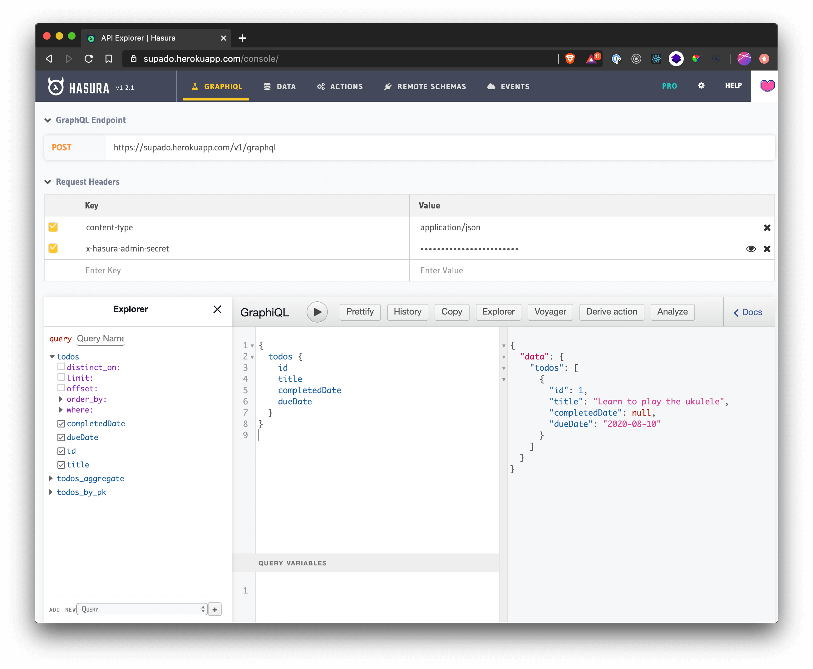

# Supado

Your task is to build a small prototype todo list manager, using React. We've already built a barebones [GraphQL API](https://supado.herokuapp.com/console/) using [Hasura](https://hasura.io/) which you can login to using the password we've supplied separately:

## GraphQL API

As we're only building a prototype, the API surface is small: there's a single table `todos`, with the following columns:

- `id: integer, primary key, unique`
- `title: text`
- `completedDate: date, nullable`
- `dueDate: date, nullable`

A todo is considered complete if the `completedDate` is not `null`.

## Your task

Using [Create React App](https://github.com/facebook/create-react-app), we'd like you to create a single page web app that allows the user to do the following:

- See a list of all todos – separated into two sections: **Todo** and **Completed**.
- Create a new todo.
- Mark an existing todo as complete.
- Modify the title of an existing todo.
- Delete an existing todo.

Even though it's a prototype, it should still:

- Have a sufficient amount of styling to establish a clear visual hierarchy.
- Respect user accessibility with regards to any button labels, colours, keyboard navigation, etc.

From the **technical** side, your code should be written using the latest version of React (16.13.1 at the time of writing), making full use of modern React features such as [Hooks](https://reactjs.org/docs/hooks-intro.html).

## Optional tasks

Completing everything listed above is all that's needed, but feel free to add any of the following if you'd like to:

- Use [Tailwind CSS](https://tailwindcss.com/) to style the app.
- Make the web app fully responsive across multiple breakpoints.
- Use Typescript.
- Allow the user to set a priority or set a custom order for their todos.
- 'Soft delete' tasks, allowing the user to [navigate](https://github.com/reach/router) to a 'Recently deleted' page and restore them.

If there's something else you'd like to add, by all means please do so. Also, you're completely free to make modifications to the GraphQL API if you want to.

## Submission

When you're happy with everything, ensure we can successfully run the project with `npm install && npm start`, please send the repo link to **jobs@supapass.com**.

## Tips

- You may choose to use a library like [Apollo](https://www.apollographql.com/docs/react/) to make working with GraphQL easier. It comes with a variety of useful hooks such as `useQuery` and `useMutation`.
